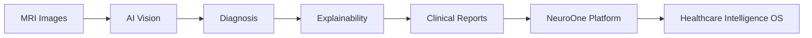
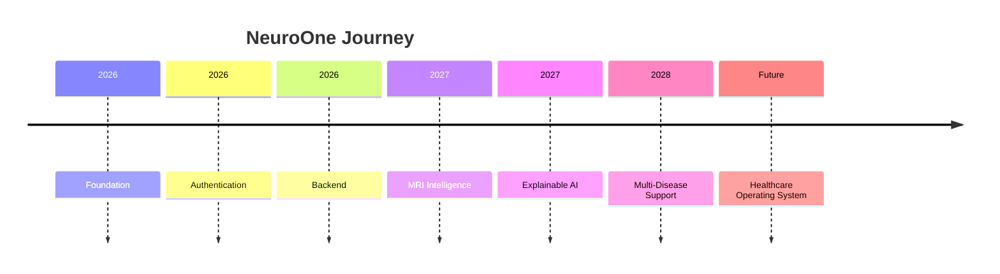

<div align="center">


<p>


</p>

</div>

---

# ✦ The Vision

> **NeuroOne** isn't just another medical AI project.

It is an attempt to build a modular intelligence platform capable of assisting clinicians, researchers and patients through explainable artificial intelligence.

Today it starts with **MRI-based neurodegenerative disease analysis**.

Tomorrow it grows into a complete **Healthcare Intelligence Platform**.

<p align="center">

</p>

# ✦ Ecosystem

<div align="center">


</div>

---

# ✦ Platform Evolution



---

# ✦ System Architecture

<p align="center">

```text
                ┌───────────────────────────────┐
                │        NeuroOne Core          │
                └──────────────┬────────────────┘
                               │
      ┌────────────────────────┼────────────────────────┐
      │                        │                        │
 AI Services              Backend APIs          Authentication
      │                        │                        │
      └──────────────┬─────────┴──────────┬─────────────┘
                     │                    │
               PostgreSQL             Medical AI
                     │                    │
                     └───────────┬────────┘
                                 │
                          Doctor Dashboard
```

</p>

---

# ✦ Current Development

<div align="center">

| Module | Progress |
|:--|:--:|
| 🔐 Authentication | 🟢 Complete |
| ⚙️ Backend APIs | 🟢 Complete |
| 🧠 AI Pipeline | 🟡 In Progress |
| 🖥️ Dashboard | 🟡 In Progress |
| 📊 Explainable AI | 🔵 Planned |
| ☁️ Deployment | ⚪ Planned |

</div>

---

# ✦ Repository

```text
NeuroOne
├── ai/
├── backend/
├── frontend/
├── database/
├── docker/
├── docs/
└── assets/
```

---

# ✦ Design Principles

- 🧠 AI First
- 🔒 Privacy by Design
- ⚡ Fast & Modular
- 📈 Scalable Architecture
- 🩺 Built for Real Clinical Workflows


---

# ✦ Roadmap



---

<div align="center">

### Building the Future of Medical Intelligence


</div>
