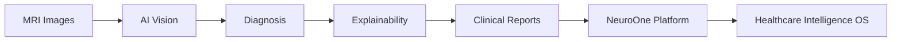
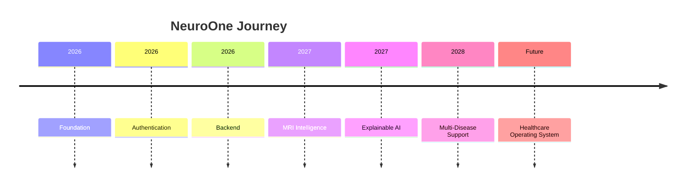

<div align="center">


<p>


</p>

</div>

---

# ✦ The Vision

> **NeuroOne** isn't just another medical AI project.

It is an attempt to build a modular intelligence platform capable of assisting clinicians, researchers and patients through explainable artificial intelligence.

Today it starts with **MRI-based neurodegenerative disease analysis**.

Tomorrow it grows into a complete **Healthcare Intelligence Platform**.

<p align="center">

</p>

# ✦ Ecosystem

<div align="center">


</div>

---

# ✦ Platform Evolution


```mermaid
flowchart LR
A[MRI Images] --> B[AI Vision]
B --> C[Diagnosis]
C --> D[Explainability]
D --> E[Clinical Reports]
E --> F[NeuroOne Platform]
F --> G[Healthcare Intelligence OS]
```

---

# ✦ System Architecture

<p align="center">

```text
                ┌───────────────────────────────┐
                │        NeuroOne Core          │
                └──────────────┬────────────────┘
                               │
      ┌────────────────────────┼────────────────────────┐
      │                        │                        │
 AI Services              Backend APIs          Authentication
      │                        │                        │
      └──────────────┬─────────┴──────────┬─────────────┘
                     │                    │
               PostgreSQL             Medical AI
                     │                    │
                     └───────────┬────────┘
                                 │
                          Doctor Dashboard
```

</p>

---

# ✦ Current Development

<div align="center">

| Module | Progress | What that actually means |
|:--|:--:|:--|
| 🔐 Authentication | 🟢 Complete | Login, JWT, OTP sign-in, password reset. Accounts are admin-provisioned; there is no self-registration. |
| ⚙️ Backend APIs | 🟢 Complete | 35 endpoints across patients, visits, symptoms, scans, analyses, reports and triage. 400 tests, run in CI. |
| 🧠 AI Pipeline | 🟡 Contract complete, providers simulated | Orchestrator, ranking, trend detection and the output contract are real and enforced. Literature retrieval and MRI staging are **mocked**; reasoning can run against a live model. Every analysis states which parts were simulated. |
| 🖥️ Dashboard | 🔴 Not started against real data | The current screens render hardcoded arrays and call no clinical endpoint. Being replaced by a triage queue. |
| 📊 Explainable AI | 🟡 In the API, not yet in the UI | Ranked differentials, supporting and contradicting findings, citations, and per-patient trend references are all returned today. Nothing renders them yet. |
| ☁️ Deployment | 🟡 Partial | Compose runs Postgres, applies migrations, then starts the API with scans on a named volume. The frontend is not in Compose yet, and OTP email needs `GMAIL_ADDRESS`/`GMAIL_APP_PASSWORD` from the host environment. |

</div>

> **Status, stated plainly.** The backend implements the full clinical journey and is
> tested. The frontend is not connected to it. NeuroOne is not clinically validated, is
> not a diagnostic device, and assists clinicians rather than diagnosing. Demo data is
> synthetic. See [`reports/PROGRESS_REPORT.md`](reports/PROGRESS_REPORT.md) for the
> detailed state and [`docs/decisions/`](docs/decisions/) for the decisions behind it.

---

# ✦ Repository

```text
NeuroOne/
├── backend/
│   ├── app/
│   │   ├── api/
│   │   │   ├── v1/          # auth, admin, patients, visits, analyses, reports, triage
│   │   │   ├── dependencies.py
│   │   │   └── router.py
│   │   ├── core/            # config, database, security
│   │   ├── models/          # SQLAlchemy: user, patient, visit, symptom, scan, analysis, report
│   │   ├── schemas/         # Pydantic wire contracts
│   │   ├── services/
│   │   ├── repositories/
│   │   ├── ai/              # orchestrator, context, ranking, trends, providers/, corpus/
│   │   ├── reports/         # PDF rendering
│   │   ├── utils/
│   │   └── main.py
│   ├── alembic/versions/    # 13 migrations
│   ├── tests/               # 400 tests
│   ├── Dockerfile
│   └── requirements.txt
├── frontend/
│   ├── src/                 # the application
│   │   ├── app/
│   │   ├── components/
│   │   ├── hooks/
│   │   └── lib/
│   └── web-page/            # parked design reference, not a build target
├── docs/
│   ├── decisions/           # ADR-001 .. ADR-006
│   ├── PRD.md, TRD.md, APP-FLOW.md, NEUROONE-MVP-SCOPE.md
│   └── REPORT-01D-frontend-checklist.md
├── reports/                 # PROGRESS_REPORT.md and generated documents
├── scripts/                 # bootstrap_admin, seed_demo_case, dump_backend_routes
├── backend-routes.json      # OpenAPI dump, regenerate with scripts/dump_backend_routes.py
├── docker-compose.yml
├── README.md
└── LICENSE
```

---

# ✦ Design Principles

- 🧠 AI First
- 🔒 Privacy by Design
- ⚡ Fast & Modular
- 📈 Scalable Architecture
- 🩺 Built for Real Clinical Workflows


---

# ✦ Roadmap


```mermaid
timeline
title NeuroOne Journey
2026 : Foundation
2026 : Authentication
2026 : Backend
2027 : MRI Intelligence
2027 : Explainable AI
2028 : Multi-Disease Support
Future : Healthcare Operating System
```

---

<div align="center">

### Building the Future of Medical Intelligence


</div>
