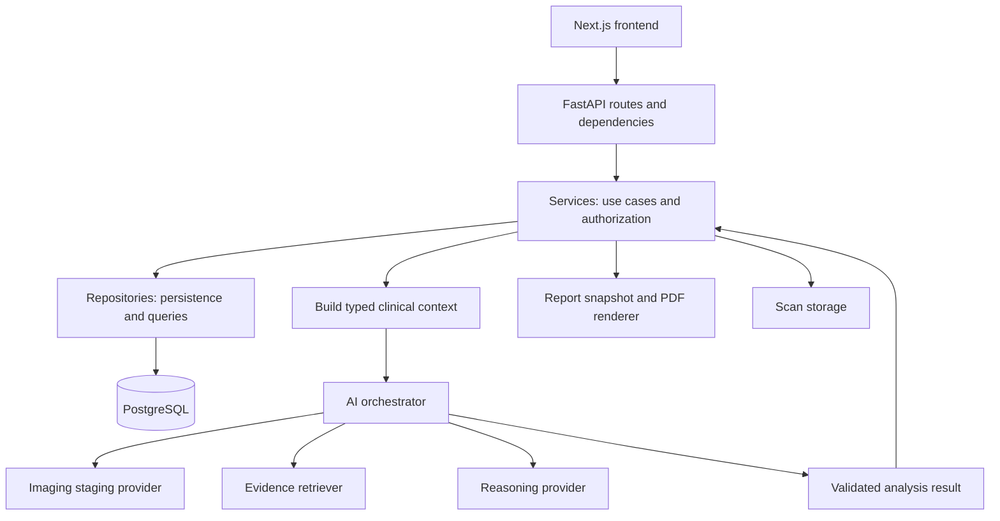
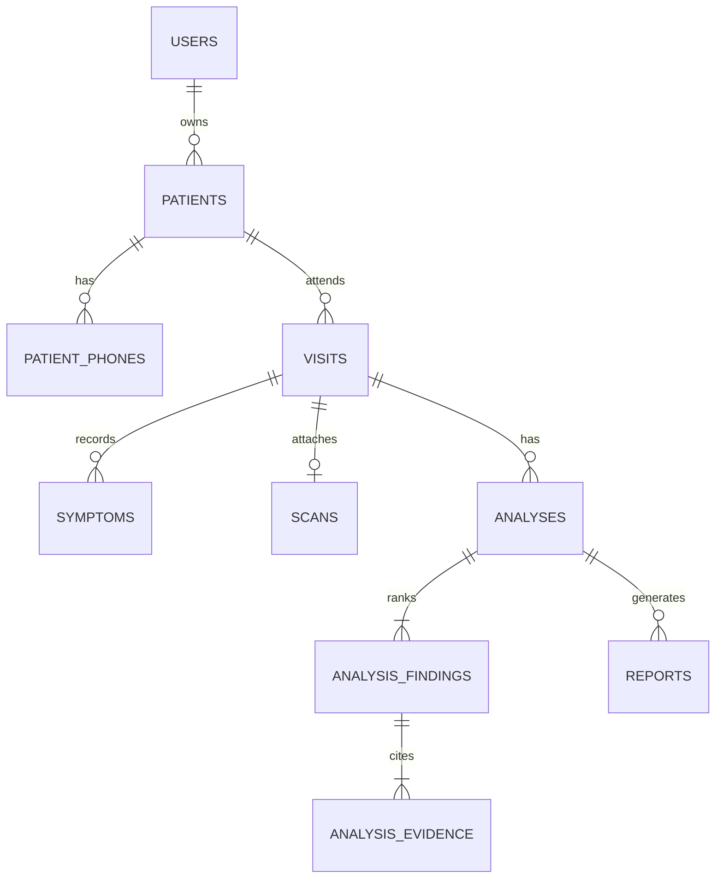

# NeuroONE project handbook

Audit date: **2026-09-13**. Implementation baseline: **`a01ae83`**. Audience: you and your team preparing to explain the project to your professor.

For evidence and unresolved differences, use [AUDIT.md](AUDIT.md). For spoken explanations, use [PROFESSOR-PRESENTATION.md](PROFESSOR-PRESENTATION.md).

## Contents

1. [Product and purpose](#1-product-and-purpose)
2. [Requirements and scope](#2-requirements-and-scope)
3. [The complete user journey](#3-the-complete-user-journey)
4. [System architecture](#4-system-architecture)
5. [Technology stack](#5-technology-stack)
6. [Domain and database](#6-domain-and-database)
7. [API and typed contracts](#7-api-and-typed-contracts)
8. [AI pipeline](#8-ai-pipeline)
9. [What the three providers actually do](#9-what-the-three-providers-actually-do)
10. [Early detection and trends](#10-early-detection-and-trends)
11. [Ranking, uncertainty and provenance](#11-ranking-uncertainty-and-provenance)
12. [Authentication and authorization](#12-authentication-and-authorization)
13. [Reports and snapshots](#13-reports-and-snapshots)
14. [Architectural decisions](#14-architectural-decisions)
15. [Progress and remaining work](#15-progress-and-remaining-work)
16. [Tests and what they prove](#16-tests-and-what-they-prove)
17. [Repository map and configuration](#17-repository-map-and-configuration)
18. [Graphify and project memory](#18-graphify-and-project-memory)
19. [Glossary and recall exercises](#19-glossary-and-recall-exercises)

## 1. Product and purpose

NeuroONE is a **clinical decision-support platform for neurological case evaluation**. Its product design combines MRI scan intake, structured clinical information, patient history and literature-supported reasoning. The clinician receives a ranked set of possible conditions with supporting and contradicting findings, explanations and citations.

The project addresses the difficulty of correlating clinical information over time and keeping an explanation connected to its evidence. Its early-detection narrative is a product ambition. The current demo demonstrates a software workflow for organizing and reviewing signals. It does not establish that a trained model detects disease early in real patients.

The primary user is a **clinician** who manages patients and visits. An **administrator** provisions accounts. The receptionist role, biomarkers and automated treatment decisions are not implemented MVP features.

The governing safety boundary is practical: a machine-generated possibility needs human interpretation. Output must not become an autonomous diagnosis. Sign-off before report creation is one enforcement mechanism; it is not a substitute for clinical validation.

**Say aloud:** “We built a system that helps a clinician review structured information and trace the reasoning. We have not demonstrated clinical diagnostic accuracy.”

Sources: [PRD §1–§4 and §7](../PRD.md), [MVP purpose and early-detection design](../NEUROONE-MVP-SCOPE.md), [ADR-006](../decisions/ADR-006-mri-primary-with-symptoms-as-context.md).

## 2. Requirements and scope

| Requirement | What the product asks for | Current implementation qualification |
|---|---|---|
| FR-01 Authentication | Secure login, hashed passwords, JWTs and protected access | Password login, backend-enforced OTP by default, reset and admin provisioning exist. OTP and rate-limit state remain process-local. |
| FR-02 Patient management | Create, retrieve and update patients, associated with cases | Authorized CRUD, search and soft deletion exist. Frontend consumers exist. |
| FR-03 Clinical input | Symptoms, duration, severity, observations, history and additional case information | Backend schemas support these fields. Follow-up UI captures symptom name, severity and onset; duration and observations are not exposed there. New-patient intake does not submit structured symptoms. |
| FR-04 Differential diagnosis | Ranked possibilities with uncertainty and reasoning | Enforced structured output and likelihood bands. Stage-first ranking is a requirement with an observed enforcement gap. |
| FR-05 Literature retrieval | Trusted literature with preserved metadata | Retrieval workflow is implemented over a simulated corpus. Real curated retrieval remains proposed. |
| FR-06 Explainability | Patient findings, reasoning, evidence and citations | Backend returns them and current UI renders them. Mock imaging region values are not scientific attributions. |
| FR-07 Report | Clinical information, findings, citations, disclaimer and review details | PDF creation is gated by sign-off. Snapshot/PDF omits reviewer identity and sign-off time despite the revised requirement. |
| FR-08 Scan intake and staging | Scan per visit, retention, staging and provenance | Scan intake/storage and mock staging exist. File bytes are not interpreted as MRI anatomy. Dimensions are currently stored as an empty object by upload. |

MRI became in scope through accepted ADR-006 and revised PRD text. The APP-FLOW document still contains its earlier MRI exclusion. This is a documented inconsistency, not a reason to describe the inspected scan functionality as nonexistent.

Hard exclusions remain uploaded diagnostic-report analysis, autonomous diagnosis and automated treatment decisions. Biomarkers and a receptionist role remain deferred. Proposed retrieval work does not authorize widening those exclusions.

Sources: [PRD FR-01–FR-08](../PRD.md), [APP-FLOW §10](../APP-FLOW.md), [symptom schemas](../../backend/app/schemas/symptom.py), [new intake](../../frontend/src/app/dashboard/upload/page.tsx), [follow-up form](../../frontend/src/app/dashboard/patients/[id]/visits/new/page.tsx).

## 3. The complete user journey

Current PRD §8 acceptance journey:

```text
Login → Patient → Visit (Scan + Symptoms) → AI Analysis
      → Ranked Differential + Evidence → Clinician Review & Sign-off → PDF Report
```

The dashboard adds a triage queue before patient selection. The older APP-FLOW uses “Case” for the clinical encounter. The implemented domain calls it **Visit**. A patient is the person; a visit is their clinical encounter at a point in time.

| Stage | User action | System action |
|---|---|---|
| Login | Enter account credentials | Validate credentials, issue JWT, load `/auth/me` |
| Dashboard | Review queue | Retrieve authorized patients and latest analysis-derived flags |
| Patient | Choose existing patient or create demographics | Persist patient linked to a clinician |
| Visit | Record complaint/history and symptoms, optionally attach scan | Persist encounter and inline symptoms; upload file separately |
| Analysis | Run pipeline | Authorize, read history, build context, stage scans if present, retrieve, reason, validate, persist |
| Findings | Open ranked candidates | Display likelihood, explanation, supporting/contradicting findings, history references and citations |
| Review | Select sign-off | Record reviewing user's id and timestamp on analysis |
| Report | Download | Reuse or create report snapshot, then fetch protected PDF bytes |

The scan is a primary product input but optional in the current backend. Symptoms-only analysis is supported when there is matching evidence. A visit with no scan and no useful structured or complaint input can return `rag_no_evidence`.

The frontend new-patient intake performs multiple requests: patient, visit, optional scan, analysis. These do not form one database transaction. An analysis failure preserves previously saved records, but the form currently has no resume tracking for patient/visit creation. Retrying can create another patient. The follow-up form retains a created visit id in memory so an analysis retry can resume. A refresh loses that state.

**Recall:** Why is “saved successfully” different from “analysis succeeded”? Because patient and visit persistence happens before a separate analysis request.

Sources: [PRD §8](../PRD.md), [APP-FLOW](../APP-FLOW.md), [endpoint client](../../frontend/src/lib/endpoints.ts), [intake](../../frontend/src/app/dashboard/upload/page.tsx), [follow-up](../../frontend/src/app/dashboard/patients/[id]/visits/new/page.tsx), [patient analysis page](../../frontend/src/app/dashboard/patients/[id]/page.tsx).

## 4. System architecture



| Layer | Responsibility | Example |
|---|---|---|
| Client | Forms, screens, API calls and loading/error states | Patient detail and findings components |
| API | HTTP routing, validation, auth dependencies, response serialization | `POST /visits/{id}/analyses` |
| Service | Business decisions and coordination | Analysis service authorizes visit, loads history, runs pipeline and persists result |
| Repository | Database queries and transactional persistence | Analysis repository creates findings/evidence and changes visit status together |
| Model | Stored entity definition | Visit, analysis finding, evidence |
| Schema | Shape and constraints of input/output | DiagnosisCandidate and VisitCreate |

The orchestrator has no database session. It accepts typed context and returns typed output. The context builder is the limited exception that reads already-loaded ORM attributes, without querying. Persistence belongs to the service/repository path.

That separation lets a test replace a failing provider without needing a real model or literature service. It also means swapping a provider should not require replacing the UI, report renderer or database contract.

Observed transaction convention: generic repositories commit and roll back; specialized repositories group particular entity graphs into one transaction. The agent contract asks for an explicit transaction-ownership ADR before a multi-repository use case, but a dedicated decision establishing that general convention was not found. Describe the actual behavior and carry the documentation gap forward.

Sources: [TRD §1 and §4](../TRD.md), [dependency wiring](../../backend/app/api/dependencies.py), [analysis service](../../backend/app/services/analysis_service.py), [base repository](../../backend/app/repositories/base_repository.py), [analysis repository](../../backend/app/repositories/analysis_repository.py).

## 5. Technology stack

| Technology | Role in this project | What to say if asked why |
|---|---|---|
| Python / FastAPI | Backend routes and request handling | Fits the Python AI ecosystem and typed HTTP APIs |
| Pydantic 2 | Validate request/response and AI contracts | A model response must satisfy an explicit structure before use |
| SQLAlchemy | ORM and database queries | Maps domain entities to relational persistence |
| Alembic | Versioned schema changes | Records how the database evolves with the code |
| PostgreSQL | Application database | UUIDs, relationships, constraints, JSONB and supported production schema |
| Passlib / bcrypt_sha256 | Password hashing | Store a verification hash instead of a plaintext password |
| python-jose / JWT | Signed, expiring access tokens | Protected requests can authenticate a token |
| httpx | Live LLM HTTP transport | Uses an OpenAI-compatible wire format without a vendor SDK |
| ReportLab | PDF rendering | Generates a PDF from a typed snapshot without browser printing |
| Next.js 14 / React 18 / TypeScript | Actual frontend | Routes, components and typed API consumption |
| Tailwind CSS | UI styling | Shared tokens and reusable primitives |
| React Hook Form / Zod | Client form validation | Immediate feedback before sending a request |
| Axios | Frontend HTTP client | Token header, shared base URL and controlled error handling |
| pytest / Vitest / Testing Library | Backend and frontend tests | Deterministic service/contract tests and mocked component workflows |
| Docker Compose | Local API/database definition | Useful packaging, with unresolved configuration and scan-storage gaps |

The repository also uses Three.js/React Three Fiber and motion libraries for landing-page presentation. Those visuals do not prove MRI inference works.

PyTorch, ADNI, OASIS, Google Colab, Redis and vector embeddings appear in vision/design material or proposed directions. The inspected backend dependency list and provider code do not establish a trained PyTorch staging model, an ADNI/OASIS training pipeline, a Redis OTP service or a vector retrieval index. Keep those separate from the implemented stack.

Sources: [backend dependencies](../../backend/requirements.txt), [frontend package](../../frontend/package.json), [security helpers](../../backend/app/core/security.py), [existing presentation](../NeuroOne%20Project%20PPT.pptx).

## 6. Domain and database

The mapped ORM metadata currently contains **ten tables**. File count, model-class count and migration count are different things. Thirteen migration files do not mean thirteen domain entities.



| Table | Important contents | Reason it exists |
|---|---|---|
| `users` | Username, email, password hash, role, active/verified flags | Accounts and clinician identity |
| `patients` | Demographics, contacts, allergies, clinician `doctor_id` | Patient record and ownership root |
| `patient_phones` | Patient-linked phone numbers | Multiple phone entries without a single overloaded field |
| `visits` | Patient id, date, complaint, history, vitals, notes, status | Clinical information at a point in time |
| `symptoms` | Visit id, symptom name, severity, duration, onset, observation | Structured findings for reasoning and comparison |
| `scans` | Unique visit id, storage key, filename, MIME type, bytes count, checksum, dimensions, uploader | Retained scan source metadata |
| `analyses` | Visit/requester ids, model/provenance, context snapshot, review identity/time | One saved pipeline run |
| `analysis_findings` | Analysis id, zero-based rank, condition name, category, confidence, findings, explanation, trend JSON | Ranked possible conditions |
| `analysis_evidence` | Finding-linked source, citation, passage and document metadata | Preserve each candidate's evidence |
| `reports` | Analysis/generator ids, filename, generated time, JSON snapshot | Stable report contents for later download |

A visit has **at most one scan**, enforced through a unique visit foreign key. A later scan should belong to a new visit. A visit can have **multiple analyses**, because rerunning creates another result rather than overwriting its history. Accepted ADR-006's phrase “one analysis per visit” means one combined scan-plus-symptom analysis path, not a unique analysis-row constraint.

Visit status vocabulary is `draft`, `submitted`, `analyzed`, `closed`. The API rejects attempts to assign `analyzed`, which is owned by the analysis pipeline. Do not imply that the full sequence is a rigorously enforced state machine unless separately verified.

Base records use UUID identifiers, timestamps and soft-delete fields. Ordinary repository reads omit soft-deleted rows. Child reads also verify the parent, so deleting a parent can make its children inaccessible without physically erasing all retained data. Soft deletion is not a defined patient-data erasure policy.

`trend_basis` is JSON containing a historical explanation and references. It is a snapshot, not a live join that should rewrite an old analysis whenever a symptom changes. Evidence, by contrast, is stored as a finding-scoped table with preserved metadata.

Scan bytes live on the filesystem through `ScanStorage`. PDF bytes are generated in memory from a persisted report snapshot. A scan cannot be reconstructed from a stage label; a report can be rendered again from its stored content.

Sources: [models](../../backend/app/models/__init__.py), [patient](../../backend/app/models/patient.py), [visit](../../backend/app/models/visit.py), [analysis](../../backend/app/models/analysis.py), [scan](../../backend/app/models/scan.py), [report](../../backend/app/models/report.py), [visit service](../../backend/app/services/visit_service.py).

## 7. API and typed contracts

The application API prefix is **`/api/v1`**. Current OpenAPI generation produces **35 method/path operations** under this prefix. `/`, `/health` and documentation routes are outside this count. A path with GET and POST counts as two operations.

| Group | Actual method/path operations, without `/api/v1` |
|---|---|
| Authentication, 6 | `POST /auth/login`; `GET /auth/me`; `POST /auth/forgot-password`; `POST /auth/reset-password`; `POST /auth/request-otp`; `POST /auth/verify-otp` |
| Admin, 1 | `POST /admin/users` |
| Patient records, 6 | `POST /patients`; `GET /patients`; `GET /patients/search`; `GET /patients/{id}`; `PATCH /patients/{id}`; `DELETE /patients/{id}` |
| Patient visits/history, 3 | `POST /patients/{id}/visits`; `GET /patients/{id}/visits`; `GET /patients/{id}/visits/history` |
| Visit records, 3 | `GET /visits/{id}`; `PATCH /visits/{id}`; `DELETE /visits/{id}` |
| Symptoms, 4 | `GET /visits/{id}/symptoms`; `POST /visits/{id}/symptoms`; `PATCH /visits/{id}/symptoms/{symptom_id}`; `DELETE /visits/{id}/symptoms/{symptom_id}` |
| Scan, 2 | `POST /visits/{id}/scan`; `GET /visits/{id}/scan` |
| Visit analysis, 3 | `POST /visits/{id}/analyses`; `GET /visits/{id}/analyses`; `GET /visits/{id}/analyses/latest` |
| Analysis/review, 2 | `GET /analyses/{id}`; `POST /analyses/{id}/review` |
| Reports, 4 | `POST /analyses/{id}/reports`; `GET /analyses/{id}/reports`; `GET /reports/{id}`; `GET /reports/{id}/pdf` |
| Triage, 1 | `GET /triage` |

`GET /admin/users` is mentioned in older documentation, but the inspected API defines only POST.

Important payload distinctions:

- Login submits JSON with `username` and `password`. The current frontend passes the entered email as `username`; the auth service supports the appropriate account lookup. The older frontend README's form-encoded login assumption is stale.
- Patient creation submits demographic JSON. It does not upload a scan or automatically run analysis.
- Visit creation can submit structured symptoms inline so the visit and symptoms save together.
- Scan upload uses multipart data with field **`file`** on the visit route.
- Analysis creation accepts a `history_limit`, default 10, allowed 0–50.
- Review records sign-off. There is no amended-findings request payload or separate amendment editor in the inspected implementation.
- PDF download returns binary bytes. The frontend creates an object URL for the browser download.

Collection responses commonly use `{ items, pagination }`, where pagination contains `page`, `page_size`, `total_records`, `total_pages`. Visit history uses a different bounded-history shape: patient id, total visits, returned count, order and visits. API errors use `message`, `error_code`, `details`.

The AI contract requires a nonempty candidate name and explanation, supporting findings, category, confidence and at least one evidence item. `early_watch` requires nonempty `trend_basis`. Unknown fields on the structured AI models are rejected. The candidate schema accepts confidence 0–1, while shipped providers clamp to 0.92. The output type alone does not enforce the 0.92 ceiling for any arbitrary future provider.

**Recall:** Is a frontend TypeScript type sufficient validation? No. It helps developers use a response, while server-side Pydantic validation and business rules enforce the actual boundary.

Sources: [API router](../../backend/app/api/router.py), [endpoints client](../../frontend/src/lib/endpoints.ts), [common schemas](../../backend/app/schemas/common.py), [analysis schemas](../../backend/app/schemas/analysis.py), [auth service](../../backend/app/services/auth_service.py), [admin API](../../backend/app/api/v1/admin.py).

## 8. AI pipeline

Read the pipeline as a sequence of responsibilities, not as a claim that every component is a trained model.

```text
Authorize visit and patient
  → read the patient's other visits
  → normalize loaded records into typed clinical context
  → calculate symptom trends
  → stage current/prior scans if a current scan exists
  → calculate stage trend
  → build literature query
  → retrieve and rank evidence
  → pass context/evidence to reasoning provider
  → resolve provider-selected citations against retrieved documents
  → rank and trim cited candidates
  → validate final result
  → persist analysis, findings/evidence and visit status together
```

The service authorizes the requested visit through the patient ownership rule. The context builder carries age in years and sex, complaint, history, vitals, notes, symptoms and scan metadata. It omits separate name, email, phone, address and birthdate fields. Free-text notes can still contain identifying data, so this is minimization rather than a guarantee of anonymization.

Current historical retrieval excludes the current visit id and requests the other records oldest-first. It does not filter them to dates strictly earlier than the target visit. An analysis run on an older visit can therefore include newer encounters. With more than ten other visits, the default selects the oldest ten. The current visit is appended to the trend sequence. This temporal assumption needs attention before claiming retrospective accuracy or a sophisticated longitudinal model.

The orchestrator stages prior scanned visits to compare ordinal stage labels. That is a demo comparison of simulated stage outputs, not image registration or quantitative anatomical progression.

Citation resolution is central. A provider selects an evidence `document_id`. The orchestrator looks it up in the actual retrieved set and restores the retrieved citation and passage. A provider cannot make an invented citation trustworthy just by writing a plausible title. The live client drops invalid document ids from a candidate; the orchestrator rejects unresolved ids if they reach it. Candidates without valid citations do not become saved recommendations.

Failure ordering protects clinical data. All provider calls and final validation occur before a new analysis is written. Provider exceptions become controlled errors such as `rag_error`, `rag_no_evidence`, `ai_error`, `ai_contract_error`, `ai_no_candidates` and `staging_error`. The normal error translation uses HTTP 502 for AI failures. Existing clinical records survive; the user can retry.

Sources: [analysis service](../../backend/app/services/analysis_service.py), [context builder](../../backend/app/ai/context.py), [orchestrator](../../backend/app/ai/orchestrator.py), [history repository](../../backend/app/repositories/visit_repository.py), [exceptions](../../backend/app/utils/exceptions.py).

## 9. What the three providers actually do

| Provider seam | Current implementation | What it establishes |
|---|---|---|
| `EvidenceRetriever.retrieve(query)` | `MockEvidenceRetriever` searches Python fixtures by keyword overlap | Retrieval/ranking/metadata contracts can be exercised offline |
| `LLMClient.generate_analysis(request)` | `MockLLMClient` or configurable `LiveLLMClient` | Deterministic demo reasoning or external model reasoning over the supplied context |
| `ImagingStager.stage(request)` | `MockImagingStager` only | Deterministic stage-result contract and provenance plumbing |

### Retrieval

The mock retriever uses weighted condition, symptom and complaint matches with source-tier bonuses. Its corpus contains simulated passages, even when source names resemble medical publications. A citation field is not proof that the passage was checked against a real publication.

### Mock reasoning

The mock reasoner matches a small condition table against recorded symptom severities, complaint terms, worsening trends and contradicting symptoms. It computes arithmetic scores, clamps confidence and attaches fixture evidence ids. It responds to input, but performs no learned inference.

The six symptom-driven fixture conditions are Parkinsonian syndrome, Essential tremor, Progressive amnestic cognitive impairment, Vascular cognitive impairment, Demyelinating disease and Peripheral neuropathy. These are the supported demonstration rules, not a clinically validated diagnostic coverage list. Five stage conditions supplement them.

### Live reasoning

The live client sends JSON context to an OpenAI-compatible `/chat/completions` endpoint using httpx. Base URL, model id, key and timeout are configuration. It requests JSON output, validates an intermediate payload, resolves symptom trend names to system-owned references and maps surviving candidates into the same structured contract.

It makes at most two transport attempts for retryable statuses including 429 and common server errors. That is limited retry behavior, not a background job queue. Switching a model endpoint does not by itself make retrieval or staging live.

**Observed integration gap:** `ReasoningRequest` has `imaging` and `scan_trend`, but `LiveLLMClient._render_case` currently serializes neither them nor scan metadata. Its prompt covers patient/visits/symptom trends/evidence. Consequently, do not claim the current live LLM demonstrably combines MRI staging with symptoms. An imaging provenance suffix says the staging provider ran, not that its result reached the live prompt.

### Mock imaging staging

The stager hashes the scan checksum string, selects one of five labels and derives a confidence and region breakdown from digest bytes. It does **not read the scan image**. Labels are `CN`, `MCI`, `Mild`, `Moderate`, `Severe`. The project maps CN to “Cognitively normal” and MCI to “Mild cognitive impairment” in candidate names.

Region contribution names include hippocampus and cortical regions, but their numerical values are synthetic. No segmentation, Grad-CAM, measured atrophy or real anatomical explanation is established by this provider. Editing file bytes can change the checksum and demo stage without changing a clinically meaningful image property.

Sources: [provider protocols](../../backend/app/ai/providers/base.py), [registry](../../backend/app/ai/providers/registry.py), [mock retriever](../../backend/app/ai/providers/mock_retriever.py), [mock corpus](../../backend/app/ai/corpus/mock_corpus.py), [mock reasoning](../../backend/app/ai/providers/mock_llm.py), [live reasoning](../../backend/app/ai/providers/live_llm.py), [mock staging](../../backend/app/ai/providers/mock_staging.py).

## 10. Early detection and trends

The implemented early-watch mechanism is **trend-aware reasoning over the patient's recorded visits**, with uncertainty expressed through confidence bands.

For a symptom, the trend code groups normalized names and compares severity values across at least two distinct visits. It classifies increasing series as worsening, decreasing series as improving, unchanged series as stable, and series with rises and falls as fluctuating. It does not estimate a disease progression rate or correct for inconsistent clinician scoring.

Example from the synthetic demo panel:

| Helen Marsh's recorded symptom | Visit 1 | Visit 2 | Visit 3 | Demonstrated interpretation |
|---|---:|---:|---:|---|
| Tremor | 3 | 5 | 8 | Worsening recorded severity |
| Memory loss | 2 | 3 | 4 | Worsening signal that supports an early-watch candidate in the fixture rules |

`early_watch` requires both a relevant worsening symptom trend and confidence below **0.40** in the shipped reasoning logic. A low confidence score alone cannot create the flag. A confidently ranked condition can have history references while remaining a normal differential candidate.

`trend_basis` answers **“Which of this patient's findings changed?”** Evidence answers **“Which external passage supports considering this condition?”** They solve different traceability problems.

Imaging trends compare mock stage labels on an ordinal scale. Worsening stage references enrich the stage candidate's history. The stage candidate stays `differential_diagnosis`; a worsening imaging trend alone does not make it `early_watch` in the mock logic. Triage can still mark it as worsening.

The triage queue derives flags from the **latest generated analysis** for each authorized patient. It prioritizes early-watch presence, then worsening, then awaiting sign-off, before server pagination. It does not independently infer current disease urgency from unsaved data. A new unanalysed visit may not affect the queue until analysis is run.

“Open early watch” currently means the latest analysis contains an early-watch finding. Signing off does not resolve or close that flag. There is no dedicated flag-resolution workflow. The dashboard retrieves up to 100 entries and locally filters/pages that subset while preserving server order.

**Say aloud:** “Our prototype recognizes changes in recorded visit data and makes their history visible. We still need clinical evaluation before interpreting those flags as validated early disease detection.”

Sources: [trend functions](../../backend/app/ai/trends.py), [reasoning category rule](../../backend/app/ai/providers/mock_llm.py), [triage service](../../backend/app/services/triage_service.py), [frontend queue](../../frontend/src/app/dashboard/page.tsx), [queue hook](../../frontend/src/hooks/use-patients.ts), [demo scenarios](../../scripts/seed_demo_case.py).

## 11. Ranking, uncertainty and provenance

Candidates sort by descending confidence with name as a tie-breaker. Evidence sorts by relevance, source-tier preference on ties, recency and document id. Evidence count and candidate count are bounded by configuration.

| Confidence in shipped output | Derived band |
|---|---|
| Below 0.40 | `low` |
| 0.40 to below 0.70 | `moderate` |
| 0.70 and above | `high` |

Shipped providers cap confidence at **0.92**. This number is a design ceiling intended to avoid certainty framing. It is not a measured accuracy, sensitivity, specificity or calibrated probability. A displayed 83% likelihood does not mean 83% diagnostic accuracy.

PRD/ADR-006 require the stage estimate to be the top-ranked candidate. The current ranker simply sorts confidence. A verified counterexample ranks Parkinsonian syndrome at 0.83 above a stage candidate at 0.7444. Explain stage-as-candidate as the implemented representation; describe guaranteed stage-first behavior as unfinished.

Provenance describes how a result was produced:

| Reasoning | Retrieval | Base pipeline note | Reachable in current registry? |
|---|---|---|---|
| Simulated | Simulated | `pipeline complete, evidence retrieval simulated` | Yes, default |
| Live | Simulated | `pipeline complete, live model reasoning, evidence retrieval simulated` | Yes, opt-in |
| Live | Live | `pipeline complete, evidence retrieved from live corpus` | Constant/branch exists, real retriever not wired |

For a scanned visit, append `, imaging staging simulated`. Symptoms-only runs omit that suffix. `provider_mode` describes the reasoning provider, not the whole pipeline. Read the full note before calling a result “live.”

The frontend displays provenance and disclaimer above findings. The PDF carries the note and disclaimer too. This lets a screenshot or report retain the relevant simulation disclosure.

Sources: [analysis schema and bands](../../backend/app/schemas/analysis.py), [ranking](../../backend/app/ai/ranking.py), [pipeline note](../../backend/app/ai/orchestrator.py), [UI provenance](../../frontend/src/components/analysis-provenance.tsx), [audit probes](AUDIT.md).

## 12. Authentication and authorization

Authentication answers **“Who are you?”** Authorization answers **“May you access this record?”** They are different checks.

The login path verifies a stored hash. With `AUTH_REQUIRE_OTP=true` (the default), it returns an OTP-required response and issues the expiring signed JWT only after password-and-code verification. Development can explicitly disable OTP; production configuration rejects that setting. Protected requests validate the JWT. Current password hashing defaults to `bcrypt_sha256` and verifies legacy bcrypt hashes. Accounts are admin-provisioned through `POST /admin/users`. Public registration was removed from the backend, although leftover signup code still posts to a nonexistent route.

The frontend follows the backend OTP-required response instead of offering an optional bypass. Login and password-reset codes use separate purpose keys. Codes last five minutes and allow five failed verification attempts. Login is limited to 10 attempts per 15 minutes per IP and per account; code requests to 3 per 10 minutes per email/purpose; verification/reset to 8 per 15 minutes per email/purpose. HTTP 429 carries Retry-After. Codes and fixed-window rate counters are in-memory, so restart clears them and workers do not share them. `is_verified` exists on User but currently does not gate access. Password reset does not automatically sign the user in. Console OTP delivery logs the code and identity for local development; rehearse only with synthetic data.

Enum member names are `ADMIN`, `CLINICIAN`; their Python string values are `admin`, `clinician`. Do not introduce a receptionist or researcher role because an old migration mentions one.

Record ownership follows this chain:

```text
Report → Analysis → Visit → Patient.doctor_id → current User
Scan / Symptom → Visit → Patient.doctor_id → current User
```

Clinicians access their own patient panel. Administrators are unrestricted by the patient ownership comparison. A child record does not copy `doctor_id`. Delegating to the patient ownership rule avoids inconsistent permissions after patient reassignment.

A role exclusion returns 403. A per-record ownership failure returns masked 404 so the caller cannot distinguish another clinician's record from an absent record. Child-resource errors are relabelled with the object the caller requested to avoid leaking parent ids.

The backend sets the access token as an HttpOnly, SameSite=Strict session cookie on login and OTP verification. That cookie is Secure unless `SESSION_COOKIE_SECURE=false`, which production refuses. Page scripts never see the token, so an XSS payload cannot read it. Cookie-authenticated writes must carry `X-Requested-With: XMLHttpRequest`, which a cross-site form cannot add. `Authorization: Bearer` still works for API clients. `POST /auth/logout` clears the cookie, and any 401 clears a rejected one. Frontend route protection (`proxy.ts`) still checks only that the cookie is present, and it can see the cookie only when the API is served from the frontend's host. The server validates the token and account and enforces ownership.

Every token carries the account's `token_version` as its `ver` claim, and each request compares the two. Changing the password increments the version, so a reset revokes every token issued before it at once. Logout clears only the browser's cookie; it does not revoke the token.

Sign-off (`POST /analyses/{id}/review`) is clinician-only. The route and `AnalysisService.sign_off_analysis` both refuse other roles with 403. Administrators pass every ownership check, and without this guard their sign-off would unlock a report that no clinician reviewed. Analyses an admin signed before this guard existed keep that sign-off until someone clears it.

Sources: [security helpers](../../backend/app/core/security.py), [auth service](../../backend/app/services/auth_service.py), [OTP implementation](../../backend/app/services/otp_service.py), [auth dependencies](../../backend/app/api/dependencies.py), [patient service](../../backend/app/services/patient_service.py), [auth provider](../../frontend/src/components/auth-provider.tsx), [middleware](../../frontend/src/middleware.ts), [review API](../../backend/app/api/v1/analysis.py).

## 13. Reports and snapshots

A report is a saved **content snapshot** rendered as PDF. It is not a filesystem path to a permanent PDF file.

Report generation authorizes the analysis, checks sign-off, reads the visit and patient, builds a typed snapshot and proves the renderer can generate bytes before committing a report row. Download authorizes the report and rerenders its stored snapshot without rerunning AI.

This keeps later downloads stable after subsequent edits to the source records. Multiple reports can exist per analysis. The current UI reuses an existing report when available to avoid creating another on every download.

There are two snapshot moments: the analysis stores the clinical context at analysis time; report generation builds patient/visit content from source records **at report-generation time**. Editing a visit between analysis and report can therefore combine earlier reasoning with later clinical inputs. The report becomes stable once saved, but that timing mismatch remains a design issue to resolve.

The report includes patient/visit information, clinical inputs, ranked findings, explanation, supporting/contradicting findings, patient-history traces, citations, passages, provenance and a disclaimer. The renderer escapes text markup and replaces unsupported base-font characters rather than crashing, which can lose some Unicode characters.

**Verified missing requirement:** reviewer id and review timestamp are stored on the analysis and shown in the API/UI, but `ReportSnapshot` contains no review fields. The PDF does not yet document who signed off or when. `generated_by_id` is the user who generated a report and is not a substitute for reviewer identity.

Sources: [ADR-004](../decisions/ADR-004-clinical-report-snapshot-and-rendering.md), [report service](../../backend/app/services/report_service.py), [snapshot schema](../../backend/app/schemas/report.py), [renderer](../../backend/app/reports/renderer.py), [download UI](../../frontend/src/app/dashboard/patients/[id]/page.tsx).

## 14. Architectural decisions

Remember each decision as **problem, choice, reason, cost**.

| ADR | Status | Choice and reason | Consequence to remember |
|---|---|---|---|
| [001: ownership response](../decisions/ADR-001-ownership-violation-status-code.md) | Accepted | Use 404 for foreign patient records to hide existence | Legitimate mistaken callers also see not found; role exclusions remain 403 |
| [002: ownership derivation](../decisions/ADR-002-visit-ownership-derivation.md) | Accepted | Child resources inherit patient authorization | Avoid duplicated doctor ids and relabel masked child failures |
| [003: analysis contract](../decisions/ADR-003-ai-analysis-contract-and-provider-seam.md) | Accepted | Typed provider seams, deterministic mocks, finding-scoped evidence and history snapshots | Build the contract before swapping live providers; keep orchestration database-free |
| [004: report snapshot](../decisions/ADR-004-clinical-report-snapshot-and-rendering.md) | Accepted | Persist JSON snapshot and render with ReportLab | No stored PDF binary; downloads regenerate content, source data still needs retention decisions |
| [005: live reasoning](../decisions/ADR-005-live-llm-provider.md) | Accepted | Configurable compatible HTTP client with narrow model-authored payload | System resolves citations/history ids; live reasoning can still use simulated literature |
| [006: MRI primary](../decisions/ADR-006-mri-primary-with-symptoms-as-context.md) | Accepted | MRI joins existing visit pipeline, stage becomes candidate, own staging seam, sign-off gate and queue | Scan storage becomes deployment dependency; simulation disclosure must travel with every result |
| [007: curated retrieval](../decisions/ADR-007-curated-retrieval-corpus.md) | **Proposed** | Local curated YAML, PostgreSQL full-text search, guidelines/systematic reviews | Owner choices recorded, acceptance/reviewer/licensing and actual code/content still outstanding |

Important rejected alternatives:

- One combined AI provider would couple retrieval and reasoning failures and swaps.
- Copying clinician ownership onto every child would create multiple sources of truth.
- Letting the live model author history UUIDs would make invented ids indistinguishable from stale references.
- Storing PDFs alongside snapshots would create another artifact to keep consistent.
- Replacing the symptom pipeline with imaging would discard the existing evidence and trend workflow.
- Showing two unrelated analyses would leave their disagreement unexplained.
- Attaching one “current scan” to the patient would remove the visit-based trajectory.
- A single stage badge or “model certainty” would conflict with ranked-possibility framing.

ADR-007's proposed retrieval favors existing PostgreSQL full-text search over new embedding infrastructure for a small reviewed English corpus. A future PubMed refresh would place candidate sources behind a human review gate. This is a recorded design, not code already executing in this checkout.

## 15. Progress and remaining work

Report progress by observable deliverables, rather than an unsupported percentage.

| Workstream | Inspected current state | What remains |
|---|---|---|
| Foundation/security housekeeping | Config, health, centralized errors, hashing and server auth exist | Full security review, production configuration and session hardening |
| Accounts | Password, default-enforced OTP, purpose isolation, auth rate limits, reset and admin create-account API exist | Multi-process OTP storage, leftover public signup cleanup, admin UI if required |
| Patients/visits | CRUD, search, structured symptoms and history exist | Complete symptom fields in UI; temporal history filtering; new-intake resume behavior |
| Scan intake | One scan per visit, local bytes and checksum metadata | Real format parsing/validation, dimensions, durable storage and broader failure cleanup |
| Analysis contract | Typed differential, citations, trends and controlled failure paths | Universal confidence ceiling and guaranteed required stage handling/ranking |
| Live LLM | Configurable transport and validated mapping exist | Pass staging/scan trend into prompt and verify combined reasoning |
| Retrieval | Mock keyword corpus works | Accept/implement ADR-007, reviewed/licensed content, PostgreSQL tests and prompt hardening |
| Imaging model | Deterministic seam and mock results exist | Select/train/integrate/evaluate a real staging model and establish dataset provenance |
| Review | Sign-off records id/time and gates report creation | Amendment workflow and explicit review-role policy |
| Reports | Snapshot storage and PDF generation exist | Include reviewer details and address analysis/report input-time mismatch |
| Dashboard | Current clinical calls, server order, filters and error states | Full browser rehearsal and larger-panel pagination strategy |
| Testing | 437 backend tests passed; frontend tests and CI exist | Local frontend execution, PostgreSQL migration/integration verification and full UI journey |
| Deployment | Dockerfiles and Compose definition exist | Supply required SMTP settings, scan volume/object store, confirm boot/restart behavior |
| Documentation | Requirements, seven ADRs including one proposal, Graphify context exist | Reconcile stale APP-FLOW/README/progress/checklists and graph freshness |

The development sequence recorded in AGENTS.md is SEC-01, AUTH-01, PAT-01, CASE-01, AI-01, REPORT-01, AI-02a, SCAN-01, SCAN-02, REVIEW-01, DASH-01, then AI-02b. The inspected repository has artifacts across all those phases except implemented AI-02b. Artifact presence does not mean every acceptance criterion in a phase is complete.

Recommended next work, as an **audit recommendation rather than an approved implementation plan**:

1. Rehearse the full synthetic browser journey and close the input/retry issues that block it.
2. Fix live imaging context, stage handling/ranking, report reviewer fields and temporal context consistency.
3. Make demo deployment restart-safe and configuration-complete.
4. Review and implement the curated retrieval plan, with a named reviewer and licensed source passages.
5. Integrate and evaluate real imaging separately from software-contract tests.
6. Reconcile documentation and refresh recorded context after verified changes.

No schedule or remaining-effort estimate is established. The team should assign owners and dates after reviewing these tasks.

## 16. Tests and what they prove

PR preparation reran the full backend suite at `a01ae83`: **437 passed in 7.68 seconds**, using a sandbox-permitted temporary directory. The original audit at `5d391b1` passed 414 tests in 30.33 seconds after recovering from five permission-related fixture setup errors. These were environment errors, not demonstrated product failures. Test settings use development mode, explicitly disable OTP where appropriate and use console delivery; dedicated tests cover enforced OTP and rate limits.

Tests cover auth, authorization, repositories, visits, input validation, AI contracts, staging determinism, citation resolution, trend behavior, report generation, controlled failures and synthetic seed scenarios. Live LLM transport tests use mocked HTTP; they are not evidence of a current live endpoint's availability or clinical quality.

The suite defaults to in-memory SQLite, uses selected real persistence tests and mocks for PostgreSQL-specific paths. Patient's PostgreSQL ARRAY fields prevent treating this as a complete SQLite replica of the production schema. Seed scenario tests replay the pipeline without inserting the whole patient schema into a real database.

Backend CI defines dependency installation, `alembic heads` and pytest. `alembic heads` checks revision structure, not that every migration applies successfully to PostgreSQL.

Frontend has six test files for vocabulary/utilities, findings/provenance, dashboard queue, patient analysis/report actions and new-visit behavior. CI defines lint, TypeScript checking, tests and production build. Dependencies were absent locally during this audit, so frontend execution and CI success were not independently verified.

**Recall:** A passing test confirms a tested software behavior under that test's conditions. It does not prove patient outcomes, model accuracy, deployment durability or the absence of untested requirement gaps.

Sources: [backend tests](../../backend/tests/conftest.py), [seed tests](../../backend/tests/test_seed_demo_case.py), [backend CI](../../.github/workflows/backend-tests.yml), [frontend CI](../../.github/workflows/frontend-tests.yml), [test result record](AUDIT.md).

## 17. Repository map and configuration

| Area | Start reading here |
|---|---|
| Product and behavior | `docs/PRD.md`, `docs/APP-FLOW.md`, `docs/NEUROONE-MVP-SCOPE.md` |
| Architecture intent | `docs/TRD.md`, `AGENTS.md`, `docs/decisions/` |
| App boot/routing | `backend/main.py`, `backend/app/main.py`, `backend/app/api/router.py` |
| Dependencies/auth wiring | `backend/app/api/dependencies.py` |
| Business rules | `backend/app/services/` |
| Queries and persistence | `backend/app/repositories/` |
| Stored shapes / wire shapes | `backend/app/models/`, `backend/app/schemas/` |
| AI orchestration | `backend/app/ai/orchestrator.py`, `context.py`, `trends.py`, `ranking.py` |
| Providers | `backend/app/ai/providers/` and `registry.py` |
| Scan files | `backend/app/storage/scan_storage.py` |
| PDF | `backend/app/reports/renderer.py` |
| Database history | `backend/alembic/versions/`, not the generic TRD's `migrations/` path |
| Actual frontend | `frontend/src/` |
| Design reference | `frontend/web-page/`, parked and not the main build target |
| Shared frontend contract | `frontend/src/lib/types.ts`, `api.ts`, `endpoints.ts` |
| Synthetic scenarios | `scripts/seed_demo_case.py` |
| Recorded context | `graphify-out/graph.json`, reports, snapshots and memory |

Core configuration names to recognize:

| Setting | Meaning / audited default |
|---|---|
| `DATABASE_URL` | Required database connection, do not print actual credentials |
| JWT secret/algorithm/expiry | Required token configuration |
| `SQL_ECHO` | Defaults false, helps avoid logging clinical SQL data |
| `CORS_ORIGINS` | Defaults to localhost:3000 allow-list |
| `APP_ENV` | `development` default; production rejects disabled OTP |
| `AUTH_REQUIRE_OTP` | True by default; false permitted only outside production |
| `OTP_DELIVERY` | `email` default; `console` permits local synthetic-data rehearsal |
| `GMAIL_ADDRESS`, `GMAIL_APP_PASSWORD` | Required when `OTP_DELIVERY=email`; optional with console delivery |
| `AI_PROVIDER` | `mock` default, or `live-llm` |
| `AI_STAGING_PROVIDER` | Only `mock` currently allowed |
| `AI_MAX_CANDIDATES` / `AI_EVIDENCE_PER_CANDIDATE` | Defaults 5 / 3 |
| `AI_LLM_BASE_URL`, `AI_LLM_MODEL`, `AI_LLM_API_KEY` | Configure compatible reasoning endpoint; a live selection requires a key |
| `AI_LLM_TIMEOUT_SECONDS` | Default 30 seconds per request attempt |
| `SCAN_STORAGE_DIR` | Local backend storage/scans default |
| `MAX_SCAN_SIZE_BYTES` | Default 200 MiB upload limit |
| `SESSION_COOKIE_SECURE` | True by default; false permitted only outside production |
| `NEXT_PUBLIC_API_URL` | Frontend URL including `/api/v1`, localhost:8000 default. Must share the frontend's host for `proxy.ts` to see the session cookie |

`AI_RETRIEVAL_PROVIDER=corpus` belongs to the proposal; it is not an implemented setting. Public example files contain placeholders and development defaults, which should not be treated as production configuration. This handbook does not verify a configured hosted model id is currently available.

The Compose API service currently omits Gmail settings while email delivery is the default, and backend Docker build excludes `.env`. Thus the checked-in definition is incomplete for clean API boot with default OTP delivery. Explicit console delivery avoids the Gmail configuration requirement for local synthetic-data rehearsal. It also lacks scan-storage mounting. Do not rely on the older “Compose runs” claim without testing a correctly configured environment.

The seed script creates six synthetic patients across two clinician accounts. Rerunning it deletes and recreates data for those demo usernames and deletes their stored scan files. It is a reset tool, not a harmless read-only preview. This audit did not run it against a live database. The ingest, embedding and backup scripts currently contain only docstrings.

Sources: [config](../../backend/app/core/config.py), [Compose](../../docker-compose.yml), [Dockerfile](../../backend/Dockerfile), [seed](../../scripts/seed_demo_case.py), [ingest stub](../../scripts/ingest_documents.py), [embedding stub](../../scripts/build_embeddings.py), [backup stub](../../scripts/backup.py).

## 18. Graphify and project memory

Graphify helps retrieve project concepts and relationships. It contains structural code nodes, extracted document concepts, inferred edges, dated snapshots and a small saved query-memory set. Treat it as a map that points to evidence.

The original audit at `5d391b1` found a root graph with 2,875 nodes and 6,754 links, built at `7c1308ee`, and a dated snapshot built at `9ab89749`; neither indexed ADR-007. During PR preparation, upstream main supplied refreshed graphs: root has 3,041 nodes and 7,116 links; the dated snapshot has 3,012 nodes and 7,063 links. Both record `built_at_commit=5d391b1` and now include ADR-007 source nodes. They still predate current code `a01ae83`, particularly the new auth behavior. Directory dates alone do not establish freshness.

The refreshed root links comprise 6,455 EXTRACTED, 656 INFERRED and 5 AMBIGUOUS tags; the original audit recorded 6,143 / 606 / 5. The report rounds ambiguous to 0%, which still leaves five links. Reported extraction token cost is zero input/output for that recorded graph run; that does not make every future graph/tutor operation free.

Two saved query memories were found before handbook authoring: migration/test-CI guidance and planning after AI-01. The latter mentions 247 passing tests and missing observation/evidence metadata at that historical point. Those gaps were subsequently addressed. No complete conversation transcripts were found among the inspected graph source paths, so this handbook cannot claim to reconstruct every project chat or unwritten decision.

Use `graphify query` for broad context, `graphify explain` for a concept and `graphify path` for a relationship. Graph results can be truncated and can include planning concepts that have no current implementation. Check source locations and actual source text before using a fact in the presentation.

Sources: [root graph report](../../graphify-out/GRAPH_REPORT.md), [dated graph report](../../graphify-out/2026-09-13/GRAPH_REPORT.md), [lessons](../../graphify-out/reflections/LESSONS.md), [AI-01-era query memory](../../graphify-out/memory/query_20260910_134613_a524bd57_the_parallel_ai_01_work_is_committed_and_pulled__p.md).

## 19. Glossary and recall exercises

| Term | Plain explanation |
|---|---|
| Clinical decision support | Software helps a clinician interpret information while responsibility remains human |
| Differential diagnosis | Ranked possible conditions to consider |
| RAG | Retrieve evidence and supply it to a reasoning model |
| LLM | Language model used here to propose structured reasoning |
| Provider seam | Stable interface behind which a mock can be exchanged for a real implementation |
| Provenance | Record of which components produced a result and which were simulated |
| Citation resolution | System restores evidence from actual retrieved records selected by id |
| Trend basis | References to this patient's recorded visit history |
| Likelihood band | Low, moderate or high category derived from a model score |
| Snapshot | Saved content that does not automatically change when its source records change |
| ORM | Maps Python objects to database rows |
| Migration | Versioned step changing the database schema |
| Foreign key | Database relationship tying one record to another |
| JWT | Signed expiring token; signing is not the same as encrypting its contents |
| Soft delete | Mark a row deleted and hide it from normal reads without physically erasing it |
| Checksum | Digest of bytes used here as stored file metadata and mock staging input |
| Full-text search | Proposed PostgreSQL lexical search over curated passages |
| PHI | Patient-identifying health information requiring privacy controls |

Practice without the document:

1. Explain the purpose in 20 seconds, including what remains simulated.
2. Draw patient, visit, scan, analysis, finding, evidence and report relationships.
3. Describe an analysis request from the browser to persistence.
4. Explain why a low confidence score does not automatically create `early_watch`.
5. Explain why live LLM does not mean live RAG or live MRI inference.
6. Name one accepted design tradeoff and one implementation gap for each subsystem you present.
7. Explain what 437 passing tests establish and what they do not establish.
8. Describe the next work without inventing owners, dates or results.

Use the [AI tutor](STUDY-WITH-AI.md) to mark your answers and repeat only the concepts you miss.
